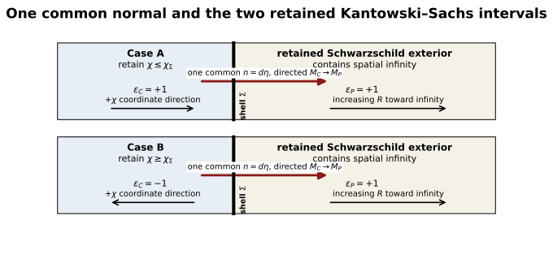

# A Strict Surface-Energy Obstruction for Timelike Kantowski–Sachs–Schwarzschild Junctions

**Ron Bibb**  
Independent Researcher, Lilburn, Georgia, USA  
Email: ronbibb@gmail.com  
ORCID: 0009-0004-1153-2464

**Keywords:** junction conditions; thin shells; Kantowski–Sachs spacetime; Schwarzschild spacetime; surface energy conditions

## Abstract

We extract from invariant spherical-shell geometry a sufficient condition for negative Israel surface density: under the ordinary-exterior orientation, a timelike junction from a sector with \((\nabla R)^2\le0\) to one with \((\nabla R)^2>0\) has \(\sigma<0\). We then prove its strict Kantowski–Sachs (KS)/Schwarzschild specialization. Because the KS areal radius has no longitudinal spatial gradient, \(2m_{{\rm MS},C}/B\ge1\) throughout the region. Consequently, at every matched radius with \(F(R)>0\), every compatible finite-rapidity embedding and either explicitly retained KS interval require \(\sigma<0\). Weak and dominant energy conditions fail independently of surface pressure, without a critical radius or cosmological-constant scale; null-energy-condition violation remains trajectory dependent. For an exact static comoving junction family, it occurs precisely outside the Schwarzschild photon sphere, \(R_0>3m\), and an explicit Nariai product region supplies a local geometric witness. The result does not apply inside the horizon or to spacelike, finite-thickness, or wormhole-connected transitions.

## 1. Introduction

Matching spacetime regions across a hypersurface is a standard construction in gravitational physics. When the induced metric is continuous but the extrinsic curvature jumps, the jump is supported by a distributional surface stress tensor governed in general relativity by the Israel conditions [1]. The method is used for stellar boundaries, collapsing shells, vacuum bubbles, wormholes, regular black holes, and proposed black-hole-to-cosmology transitions.

The last application requires careful causal and global bookkeeping. A transition surface may be timelike, spacelike, or null; the retained side of each geometry fixes the physically relevant normal orientations; and expansion of total spatial volume need not imply expansion of the areal radius. A Kantowski–Sachs representation does not by itself establish an expanding cosmology, and a Schwarzschild-time divergence at a horizon does not establish a reversed time direction.

Berezin, Kuzmin, and Tkachev (BKT) [2] derive invariant outer-curvature and junction equations valid for arbitrary spherically symmetric shells, including dynamical geometries and changes between ordinary and wormhole branches. Farhi and Guth [3], Blau, Guendelman, and Guth [4], and Farhi, Guth, and Guven [5] establish the closest physical lineage: the classical obstruction to producing an inflating universe on the ordinary asymptotic branch, the global dynamics of false-vacuum bubbles, and quantum access to the expanding wormhole-connected branch. Rosa and Carloni [6] give a complementary covariant treatment for locally rotationally symmetric spacetimes and boundaries of all causal types. The present paper does not replace or generalize those frameworks. It proves their strict consequence for a homogeneous Kantowski–Sachs side joined to the retained asymptotically flat Schwarzschild exterior. Sharif and Abbas [18] previously calculated surface density and tangential pressure for a distinct Kantowski–Sachs--Minkowski shell, while Uzan, Ellis, and Larena [19] matched static Kottler regions to a Kantowski–Sachs region at a cosmological horizon. Neither construction is the timelike KS/ordinary-Schwarzschild matching with \(F>0\) considered here. Related work has used Kantowski–Sachs variables for distinct null-shell problems [7]. Historic black-hole-to-cosmology constructions instead place the transition on a spacelike surface inside the black hole [8,9].

The same distinction is relevant to quantum-corrected black-hole interiors. Representative loop-quantum-gravity models treat the Schwarzschild interior as a homogeneous KS system: the classical singularity is replaced by a Nariai-type late-time region [14], a bounce into a white-hole interior [15], or a transition surface separating trapped and anti-trapped regions within a larger effective extension [16]. An explicit Schwarzschild-to-KS construction using a localized layer instead places a spacelike S-brane inside the horizon [17]. None of these models uses the timelike ordinary-\(F>0\) junction studied here. The present theorem does not test their quantum dynamics; it supplies the classical boundary diagnostic for a different completion in which a KS region would be attached directly to the retained ordinary exterior.

We first extract from BKT's invariant formula [2, p. 2925, Eq. (2.54a)] a sufficient-condition proposition: if a spherical timelike shell joins a sector with \((\nabla R)^2\le0\) to an ordinary-oriented sector with \((\nabla R)^2>0\), the angular Israel jump is strictly positive and the surface density is negative. The KS product geometry then supplies a region-wide realization of the first hypothesis, while the retained Schwarzschild \(F>0\) exterior supplies the second. This makes the KS comparison strict at every matched radius: the magnitude of the KS angular curvature is smaller than the Schwarzschild contribution for either retained KS interval. Negative surface energy density is therefore universal within the theorem domain; NEC violation is a separate, stronger conclusion requiring additional trajectory data. Section 5.2 shows why FRW homogeneity does not imply the same result: its areal radius retains a longitudinal spatial gradient.

The principal result is this invariant sufficient condition together with its strict, region-wide KS specialization and implication for the direct ordinary-exterior construction. The derivation fixes the exterior orientation from the retained global region, obtains both independent mixed curvature components, closes the Israel and Codazzi relations, contrasts the KS product structure with FRW geometry, treats turning points without division by \(\dot R\), and reproduces the exterior curvature in ingoing Eddington–Finkelstein coordinates.

The theorem applies to the comoving interface and to every compatible finite-rapidity shell embedding satisfying the proper-time and areal-matching relations, while \(R>0\) and \(F>0\). It does not cover \(F<0\), spacelike transitions, alternative global gluings, finite-thickness layers, or independent surface-spin sectors.

One interpretive warning will matter later: Kantowski–Sachs total-volume expansion, governed by \(\Theta=H_A+2H_B\), does not imply expansion of the symmetry spheres, which requires \(H_B>0\). Section 9 gives the corresponding shear identity and explains why this distinction prevents the junction calculation from being read as evidence for an areal bounce.

## 2. Geometry and conventions

We use signature \((-+++)\). The Kantowski–Sachs metric is

\[
ds_C^2=-N^2dt_C^2+A^2(t_C)d\chi^2+B^2(t_C)d\Omega_2^2.
\tag{1}
\]

After deriving the normalization condition we choose child proper time \(N=1\), with

\[
H_A=\frac{1}{A}\frac{dA}{dt_C},
\qquad
H_B=\frac{1}{B}\frac{dB}{dt_C},
\qquad
\Theta=H_A+2H_B.
\tag{2}
\]

The moving child embedding is

\[
X_C^\mu=(t_C(\tau),\chi(\tau),\theta,\phi),
\qquad
R(\tau)=B(t_C(\tau)).
\tag{3}
\]

The comoving case has \(\dot\chi=0\); the moving case permits every compatible finite-rapidity embedding satisfying Eq. (3), the proper-time normalizations, and the differentiated matching relation (18). Here finite rapidity means finite \(X=\sinh\zeta\), where \(\zeta\) is the shell's hyperbolic rapidity relative to the comoving KS frame; limiting sequences with \(X\to\infty\) are outside the theorem. Thus \(R(\tau)\), \(X(\tau)\), and their derivatives are not independent trajectory data once the bulk function \(B(t_C)\) and an embedding have been chosen. A dot denotes \(d/d\tau\), where \(\tau\) is shell proper time. Both embeddings are future oriented: we choose \(\dot t_C>0\), and in the \(F>0\) Schwarzschild region we choose \(\dot T>0\). Thus Eq. (15) uses the positive root \(\gamma=\dot t_C=\sqrt{1+X^2}\), while Eq. (10) uses \(\dot T=\beta/F>0\).

The Schwarzschild parent is

\[
ds_P^2=-F(R)dT^2+\frac{dR^2}{F(R)}+R^2d\Omega_2^2,
\qquad
F(R)=1-\frac{2m}{R},
\tag{4}
\]

where \(m=GM/c^2\). Its shell embedding is

\[
X_P^\mu=(T(\tau),R(\tau),\theta,\phi).
\tag{5}
\]

The theorem concerns \(F(R)>0\). The limit \(F\to0^+\) is treated only as a chart-control limit.

The first junction condition is imposed explicitly. Pulling back either bulk metric to the shell gives the common induced metric \(ds_\Sigma^2=-d\tau^2+R^2(\tau)d\Omega_2^2\); equality of the angular components is precisely the areal matching relation \(R(\tau)=B(t_C(\tau))\) in Eq. (3). The temporal component is the proper-time normalization used below on each side.

The surface tensor is

\[
\Sigma^a{}_b=\operatorname{diag}(-\sigma,p_s,p_s).
\tag{6}
\]

To fix the signed junction unambiguously, introduce a Gaussian-normal coordinate \(\eta\) in a neighborhood of the shell, with \(\eta=0\) on \(\Sigma\), \(\eta<0\) on the retained KS side, and \(\eta>0\) on the retained Schwarzschild side. We use the single normal

\[
n_\mu=\nabla_\mu\eta,
\]

directed from \(M_C\) to \(M_P\). The symbols \(n_{\mu,C}\) and \(n_{\mu,P}\) below are its one-sided limits, not two independently chosen outward normals. In particular, the common normal points out of the retained child region and into the retained parent exterior. We define

\[
[K^a{}_b]=K^a{}_{b,P}-K^a{}_{b,C}
\tag{7}
\]

and use

\[
[K_{ab}]-h_{ab}[K]
=-\frac{8\pi G}{c^4}\Sigma_{ab},
\qquad
K_{ab}=e_a{}^\mu e_b{}^\nu\nabla_\mu n_\nu.
\tag{8}
\]

The convention is anchored by \(K^\theta{}_\theta=+1/R\) for the outward normal to a round sphere in flat space. Orientation signs \(\epsilon_P,\epsilon_C\in\{-1,+1\}\) encode the components of this same common normal in the two coordinate charts.

**Table 1. Core conventions.**

| Object | Convention |
|---|---|
| Metric signature | \((-+++ )\) |
| Jump | \([K^a{}_b]=K^a{}_{b,P}-K^a{}_{b,C}\) |
| Surface tensor | \(\Sigma^a{}_b=\mathrm{diag}(-\sigma,p_s,p_s)\) |
| Extrinsic curvature | \(K_{ab}=e_a{}^\mu e_b{}^\nu\nabla_\mu n_\nu\) |
| Common normal | \(n=d\eta\), directed from retained KS side to retained Schwarzschild side |
| Ordinary retained exterior | \(\epsilon_P=+1\) |
| Theorem domain | \(F(R)>0\), finite real \(X\) |

Figure 1 summarizes the declared geometry, retained regions, and normal orientations.

**Figure 1.** Declared spherical timelike junction with the single Gaussian normal \(n=d\eta\) directed from \(M_C\) to \(M_P\). The retained Schwarzschild parent contains spatial infinity, so the parent limit of the common normal points toward increasing areal radius and \(\epsilon_P=+1\). On the KS side, retaining \(\chi\le\chi_\Sigma\) gives \(\epsilon_C=+1\), while retaining \(\chi\ge\chi_\Sigma\) gives \(\epsilon_C=-1\); in both cases the common normal points out of the retained KS region toward the parent. The \(\epsilon_P=-1\) algebraic branch retains a different Schwarzschild side and is not a sign alternative for this gluing.

## 3. Common-normal and retained-side lemma

**Lemma 1.** Let \(n=d\eta\) be directed from the retained KS region to the retained Schwarzschild region. If the Schwarzschild side contains spatial infinity, then \(\epsilon_P=+1\). On the KS side, retaining \(\chi\le\chi_\Sigma\) gives \(\epsilon_C=+1\), while retaining \(\chi\ge\chi_\Sigma\) gives \(\epsilon_C=-1\). Thus

\[
\epsilon_P=+1,
\qquad
\epsilon_C=
\begin{cases}
+1,&\chi\le\chi_\Sigma\ \text{retained},\\
-1,&\chi\ge\chi_\Sigma\ \text{retained}.
\end{cases}
\tag{9}
\]

**Proof.** The areal coordinate increases from the shell toward the asymptotically flat end. The parent limit of the common normal derived below has \(n_P^R=\epsilon_P\beta\), with \(\beta>0\). Because increasing \(\eta\) enters the retained exterior, \(\epsilon_P=+1\). On the child side, \(n_C^\chi=\epsilon_C\gamma/A\). If the retained interval is \(\chi\le\chi_\Sigma\), increasing \(\eta\) crosses its boundary toward increasing \(\chi\), so \(\epsilon_C=+1\). If the retained interval is \(\chi\ge\chi_\Sigma\), the crossing is toward decreasing \(\chi\), so \(\epsilon_C=-1\). \(\square\)

The algebraic branch \(\epsilon_P=-1\) retains the opposite side or describes a throat/back-to-back gluing; it is the branch used for wormhole-connected false-vacuum-bubble constructions [4,5]. It is not an alternative convention for the same exterior. Reversing the single common normal while also reversing the jump order leaves the physical surface tensor unchanged.

The child sign therefore labels two explicit retained-side gluings, not an independently adjustable normal: \(\epsilon_C=+1\) for \(\chi\le\chi_\Sigma\) retained and \(\epsilon_C=-1\) for \(\chi\ge\chi_\Sigma\) retained. In both constructions the normal is the same geometrical object, directed from child to parent, the jump order remains parent minus child, and the parent sign remains fixed by spatial infinity. Theorem 1 proves the same sign conclusion for either gluing.

## 4. Complete extrinsic curvature

### 4.1 Schwarzschild side

Proper-time normalization gives

\[
F\dot T^2-\frac{\dot R^2}{F}=1.
\tag{10}
\]

Define

\[
\beta=\sqrt{F+\dot R^2},
\qquad
\dot T=\frac{\beta}{F}.
\tag{11}
\]

An oriented unit normal covector is

\[
n_{\mu,P}
=\epsilon_P\left(-\dot R,\frac{\beta}{F},0,0\right),
\tag{12}
\]

with \(n_P^R=\epsilon_P\beta\). Direct calculation gives

\[
\boxed{
K^\tau{}_{\tau,P}
=\epsilon_P\frac{\ddot R+m/R^2}{\beta},
\qquad
K^\theta{}_{\theta,P}
=\epsilon_P\frac{\beta}{R}.
}
\tag{13}
\]

The acceleration form of \(K^\tau{}_{\tau,P}\) supplies its regular turning-point value without dividing by \(\dot R\).

### 4.2 Moving Kantowski–Sachs side

Child-side normalization is

\[
\dot t_C^2-A^2\dot\chi^2=1.
\tag{14}
\]

Introduce

\[
X=A\dot\chi,
\qquad
\gamma=\dot t_C=\sqrt{1+X^2}.
\tag{15}
\]

The oriented unit normal is

\[
n_{\mu,C}
=\epsilon_C(-A\dot\chi,A\dot t_C,0,0).
\tag{16}
\]

Coordinate evaluation gives

\[
\boxed{
K^\tau{}_{\tau,C}
=\epsilon_C\left(\frac{\dot X}{\gamma}+H_AX\right),
\qquad
K^\theta{}_{\theta,C}
=\epsilon_CXH_B.
}
\tag{17}
\]

Differentiating the areal matching condition yields

\[
\frac{\dot R}{R}=\gamma H_B,
\tag{18}
\]

so

\[
\boxed{
K^\theta{}_{\theta,C}
=\epsilon_C\frac{X\dot R}{\gamma R}.
}
\tag{19}
\]

An independent orthonormal-frame derivation uses

\[
u^{\hat a}=(\gamma,X),
\qquad
n^{\hat a}=\epsilon_C(X,\gamma)
\tag{20}
\]

and reproduces both components exactly. In the comoving limit \(X=\dot X=0\), both child components vanish.

**Table 2. Mixed extrinsic-curvature components.**

| Side | \(K^\tau{}_\tau\) | \(K^\theta{}_\theta\) |
|---|---|---|
| Schwarzschild parent | \(\epsilon_P(\ddot R+m/R^2)/\beta\) | \(\epsilon_P\beta/R\) |
| Moving KS child | \(\epsilon_C(\dot X/\gamma+H_AX)\) | \(\epsilon_CXH_B=\epsilon_CX\dot R/(\gamma R)\) |
| Comoving KS child | \(0\) | \(0\) |

## 5. Thin-shell obstruction

The invariant origin of the angular comparison is BKT's general formula \(K^\theta{}_\theta=R^{-1}n^\mu\nabla_\mu R\) and their angular Israel equation [2, p. 2925, Eqs. (2.54a) and (2.59a)]. BKT's orientation sign records whether areal radius increases or decreases along the outward normal, the same geometric distinction encoded here by \(\epsilon_P\) and \(\epsilon_C\); our jump is ordered parent minus child as in Eq. (7), and Eq. (8) fixes the corresponding Israel sign.

**Proposition 1 (invariant sufficient condition).** Let a timelike spherical shell of areal radius \(R>0\) join two spherical regions, denoted \(C\) and \(P\), with one common normal directed from \(C\) to \(P\). Suppose that on the shell

\[
(\nabla R)^2_C\le0,
\qquad
(\nabla R)^2_P>0,
\]

and that the retained \(P\) region fixes the ordinary orientation \(K^\theta{}_{\theta,P}>0\). Then \(\Delta K_\theta>0\) and the angular Israel equation requires \(\sigma<0\), independently of the shell acceleration and surface pressure.

**Proof.** Decomposing the areal-radius gradient in the orthonormal tangent-normal plane of the shell gives, on either side,

\[
(\nabla R)^2=-\dot R^2+\left(RK^\theta{}_{\theta}\right)^2.
\]

The two invariant hypotheses and the ordinary orientation therefore imply

\[
\left|K^\theta{}_{\theta,C}\right|
\le\frac{|\dot R|}{R}
<\frac{\sqrt{\dot R^2+(\nabla R)^2_P}}{R}
=K^\theta{}_{\theta,P}.
\]

Thus \(\Delta K_\theta\ge K^\theta{}_{\theta,P}-|K^\theta{}_{\theta,C}|>0\), and Eq. (8) gives \(\sigma<0\). \(\square\)

Proposition 1 is an explicit sufficient-condition extraction from the established invariant spherical-shell equations, not a new junction formalism. The following theorem shows that homogeneous KS geometry satisfies its interior hypothesis identically throughout the region and supplies the strict KS/ordinary-Schwarzschild specialization with both retained-side gluings made explicit.

**Theorem 1 (KS ordinary-exterior specialization).** Consider a compatible finite-rapidity embedding (3) of a homogeneous Kantowski–Sachs region into a Schwarzschild exterior with \(R>0\) and \(F(R)>0\). Retain the parent region containing spatial infinity, retain either \(\chi\le\chi_\Sigma\) or \(\chi\ge\chi_\Sigma\) on the child side, and use the common-normal conventions (6)–(8). For every finite real \(X\) allowed by that embedding,

\[
\Delta K_\theta
\equiv K^\theta{}_{\theta,P}-K^\theta{}_{\theta,C}>0
\tag{21}
\]

for either child-side orientation. Consequently \(\sigma<0\) for every shell satisfying these hypotheses, independently of surface pressure and shell acceleration. This universal sign conclusion does not by itself imply \(\sigma+p_s<0\); NEC violation requires the additional condition \(\Delta K_\tau-\Delta K_\theta<0\).

**Proof.** Since \(\gamma=\sqrt{1+X^2}\),

\[
\frac{|X|}{\gamma}<1.
\tag{22}
\]

Equation (19) therefore gives

\[
\left|K^\theta{}_{\theta,C}\right|
<\frac{|\dot R|}{R}.
\tag{23}
\]

Because \(F>0\),

\[
\frac{|\dot R|}{R}
<\frac{\sqrt{F+\dot R^2}}{R}
=\frac{\beta}{R}.
\tag{24}
\]

Lemma 1 fixes \(K^\theta{}_{\theta,P}=\beta/R>0\). Hence

\[
\Delta K_\theta
\ge \frac{\beta}{R}
-\left|K^\theta{}_{\theta,C}\right|>0
\tag{25}
\]

for either \(\epsilon_C\). The Israel equation then gives

\[
\boxed{
\sigma=-\frac{c^4}{4\pi G}\Delta K_\theta<0.
}
\tag{26}
\]

\(\square\)

**Remark 1 (ultrarelativistic limiting sequence).** The theorem concerns timelike shells and therefore finite rapidity. Along a sequence of compatible timelike embeddings with \(|X|\to\infty\), however, \(|X|/\gamma\to1\), and the limiting lower estimate remains

\[
\Delta K_\theta
\ge\frac{\sqrt{F+\dot R^2}-|\dot R|}{R}>0
\]

at every member with finite \(|\dot R|\) and \(F>0\). The gap need not be bounded uniformly away from zero when \(|\dot R|\) also grows without bound. This limiting observation does not add a null shell or an infinite-rapidity trajectory to the theorem's timelike domain.

**Corollary 1 (comoving interface).** In the comoving limit \(X=0\), the child angular curvature vanishes and

\[
\Delta K_\theta=\frac{\beta}{R}>0,
\qquad
\sigma<0.
\tag{27}
\]

Thus the ordinary-exterior obstruction includes the comoving interface as a strict special case.

### 5.1 Invariant mass interpretation

Proposition 1 already isolates the invariant mechanism; the coordinate proof of Theorem 1 remains decisive for the two explicit KS retained-side gluings because it fixes their signed Israel jumps. The same geometry also admits a useful region-wide interpretation through the Misner–Sharp geometrized mass length \(m_{\rm MS}=GM_{\rm MS}/c^2\), defined in spherical symmetry by

\[
1-\frac{2m_{\rm MS}}{R}
=g^{\mu\nu}\nabla_\mu R\nabla_\nu R.
\tag{28}
\]

For any spherical timelike shell, decomposition of the areal-radius gradient into tangential and normal parts gives

\[
g^{\mu\nu}\nabla_\mu R\nabla_\nu R
=-\dot R^2+\left(RK^\theta{}_{\theta}\right)^2.
\tag{29}
\]

On the Schwarzschild side, Eq. (28) gives \(m_{{\rm MS},P}=m\), and \(F>0\) is equivalent to \(2m/R<1\). On the homogeneous Kantowski–Sachs side, \(R=B(t_C)\) has no longitudinal spatial gradient. Consequently, throughout the KS region,

\[
g_C^{\mu\nu}\nabla_\mu R\nabla_\nu R
=-\left(\frac{dB}{dt_C}\right)^2,
\tag{30}
\]

and therefore

\[
\frac{2m_{{\rm MS},C}}{B}
=1+\left(\frac{dB}{dt_C}\right)^2\ge1,
\tag{31}
\]

with equality only where \(dB/dt_C=0\). This is a property of the KS region, independent of any shell embedding. On the shell, the areal matching relation gives

\[
\left(\frac{dB}{dt_C}\right)^2
=\frac{\dot R^2}{\gamma^2}.
\tag{32}
\]

Thus the KS symmetry spheres are marginal, future trapped, or past trapped (anti-trapped), depending on the time orientation and the sign of \(dB/dt_C\). The retained \(F>0\) Schwarzschild exterior is untrapped. Their mass difference at the common areal radius is

\[
\frac{2(m_{{\rm MS},C}-m_{{\rm MS},P})}{R}
=F+\frac{\dot R^2}{\gamma^2}>0.
\tag{33}
\]

Equations (28)–(33) give the physical content of Proposition 1 in the KS specialization: the shell joins a KS sector satisfying \(2m_{{\rm MS},C}/B\ge1\), whose spheres are trapped, anti-trapped, or marginal according to time orientation, to an ordinary untrapped exterior with smaller enclosed Schwarzschild mass length. The mass ordering alone does not determine the orientation sign of \(K^\theta{}_{\theta}\); the ordinary parent orientation and the explicit retained-side construction are therefore essential to the signed conclusion. This is the point of contact with BKT's general invariant formula [2]: Proposition 1 makes the sufficient condition explicit, and Theorem 1 proves its strict KS/ordinary-exterior realization rather than claiming an independent general formalism. The complementary \(F<0\) Schwarzschild region is trapped or anti-trapped, with the classification fixed by time orientation.

### 5.2 Why homogeneity does not impose the same result in FRW

The obstruction is not a consequence of spatial homogeneity alone. In a Friedmann–Robertson–Walker region,

\[
ds^2=-dt^2+a^2(t)\left(\frac{dr^2}{1-kr^2}+r^2d\Omega_2^2\right),
\qquad R=a(t)r,
\tag{34}
\]

the areal radius has both temporal and radial gradients. Hence

\[
g^{\mu\nu}\nabla_\mu R\nabla_\nu R
=-H^2R^2+1-kr^2,
\tag{35}
\]

and the positive radial term can make the symmetry spheres untrapped. The KS step in Eq. (30), where the longitudinal spatial derivative vanishes identically, therefore has no automatic FRW analogue. BKT's general treatment and FRW appendix already contain the corresponding outer-curvature formulas [2, pp. 2942–2943, Appendix B]. The comparison here identifies the KS geometric property that makes inequality (25) strict; it is not a new FRW junction result.

## 6. Surface tensor and energy conditions

Define

\[
\Delta K_\tau
=K^\tau{}_{\tau,P}-K^\tau{}_{\tau,C}.
\tag{36}
\]

The complete mixed Israel solution is

\[
\boxed{
\sigma=-\frac{c^4}{4\pi G}\Delta K_\theta,
\qquad
p_s=\frac{c^4}{8\pi G}
\left(\Delta K_\tau+\Delta K_\theta\right).
}
\tag{37}
\]

All independent tensor residuals vanish after substitution. Useful combinations are

\[
\sigma+p_s
=\frac{c^4}{8\pi G}
\left(\Delta K_\tau-\Delta K_\theta\right),
\tag{38}
\]

\[
\sigma+2p_s
=\frac{c^4}{4\pi G}\Delta K_\tau.
\tag{39}
\]

### 6.1 Null-energy criterion and a static comoving junction family

The shell NEC is controlled by the signed scalar

\[
\begin{aligned}
\mathcal N
&\equiv \Delta K_\tau-\Delta K_\theta \\
&=\frac{R\ddot R-\dot R^2-1+3m/R}{\beta R}
-\epsilon_C\left(
\frac{\dot X}{\gamma}+H_AX
-\frac{X\dot R}{\gamma R}
\right).
\end{aligned}
\tag{40}
\]

Equation (38) shows that the NEC is satisfied when \(\mathcal N\ge0\) and violated when \(\mathcal N<0\). The logical hierarchy is therefore sharp: \(\sigma<0\) is universal under Theorem 1, whereas NEC violation is not. The sign of \(\mathcal N\) depends additionally on the shell trajectory, acceleration, and child-side kinematics and orientation.

**Proposition 2 (static comoving junction family).** Fix \(m>0\) and \(R_0>2m\). Suppose the declared junction contains an exact static comoving boundary segment on which

\[
X=\dot X=0,
\qquad
R(\tau)=B(t_C(\tau))=R_0,
\qquad
\dot R=\ddot R=0.
\]

Then the surface tensor is given by Eq. (41b). Its NEC and \(2+1\)-dimensional SEC are satisfied for \(2m<R_0<3m\), saturated at \(R_0=3m\), and violated for \(R_0>3m\). WEC and DEC fail throughout the family.

**Proof.** This hypothesis is stronger than an instantaneous turning point: \(B\) is constant along an open segment of the comoving boundary. Both child extrinsic-curvature components vanish, whereas the ordinary-exterior Schwarzschild components remain nonzero. Equation (40) gives

\[
\mathcal N_{\rm static}
=\frac{3m-R_0}{R_0^2\sqrt{F_0}},
\qquad
F_0=1-\frac{2m}{R_0}.
\tag{41a}
\]

The complete surface stress tensor for this family is

\[
\sigma_0
=-\frac{c^4}{4\pi G}\frac{\sqrt{F_0}}{R_0},
\qquad
p_{s0}
=\frac{c^4}{8\pi G}
\frac{R_0-m}{R_0^2\sqrt{F_0}},
\qquad
w_s\equiv\frac{p_{s0}}{\sigma_0}
=-\frac{R_0-m}{2(R_0-2m)}.
\tag{41b}
\]

Consequently,

\[
\sigma_0+p_{s0}
=\frac{c^4}{8\pi G}
\frac{3m-R_0}{R_0^2\sqrt{F_0}},
\qquad
\sigma_0+2p_{s0}
=\frac{c^4}{4\pi G}
\frac{m}{R_0^2\sqrt{F_0}}>0.
\tag{41c}
\]

Within the theorem domain, the shell NEC is therefore violated for \(R_0>3m\), saturated at \(R_0=3m\), and satisfied for \(2m<R_0<3m\).

Equivalently, \(-1<w_s<-1/2\) in the NEC-violating interval, \(w_s=-1\) at the threshold, and \(w_s<-1\) below it. These ratios classify the surface tensor algebraically; because \(\sigma_0<0\), they should not be read as ordinary positive-density fluid equations of state. For the intrinsic \(2+1\)-dimensional shell, the SEC requires NEC together with \(p_s\ge0\) [20]. Equation (41b) shows \(p_{s0}>0\) throughout \(R_0>2m\), so the static family's SEC disposition is controlled entirely by the NEC. This proves the proposition. \(\square\)

The threshold \(R_0=3m\) is the Schwarzschild photon-sphere radius, so the required surface tensor violates NEC precisely outside the photon sphere within this static junction family. Define the dimensionless stresses

\[
\widetilde{\sigma}_0=\frac{8\pi Gm}{c^4}\sigma_0,
\qquad
\widetilde{p}_{s0}=\frac{8\pi Gm}{c^4}p_{s0}.
\]

Figure 2 displays these scaled quantities and their energy-condition combinations across the family. The same algebraic boundary appears in the distinct construction of a static Schwarzschild thin-shell wormhole, for which NEC is satisfied at the throat when \(2m<a_0\le3m\) [13, Appendix A]. That construction glues two Schwarzschild exteriors with wormhole orientations; Proposition 2 instead has vanishing child curvature from a KS product region and retains one ordinary exterior. The shared threshold is therefore attributed to the static Schwarzschild curvature combination, not claimed as unique to KS.

**Figure 2.** Scaled surface stresses \(\widetilde{\sigma}_0\) and \(\widetilde{p}_{s0}\), defined immediately above, for the exact static comoving junction configurations. Each plotted radius corresponds to a different Nariai scale \(\Lambda=R_0^{-2}\), not to a sequence of equilibria in one fixed bulk theory. The surface density remains negative and \(\widetilde{\sigma}_0+2\widetilde{p}_{s0}\) remains positive throughout \(R_0>2m\), while \(\widetilde{\sigma}_0+\widetilde{p}_{s0}\) changes sign at the Schwarzschild photon sphere, \(R_0=3m\). The plotting window truncates the pressure divergences as \(R_0\to2m^+\).

The family admits an explicit local isotropic bulk realization obtained by taking \(B=R_0\) throughout a KS interval. In \(c=1\) units, the independent Einstein equations then reduce to

\[
\kappa\rho=\frac{1}{R_0^2},
\qquad
\kappa p_\chi=-\frac{1}{R_0^2},
\qquad
\kappa p_\perp=-\frac{\ddot A}{A}.
\tag{41d}
\]

Isotropy is therefore achieved with \(p_\chi=p_\perp=-\rho\) provided

\[
\frac{\ddot A}{A}=\frac{1}{R_0^2},
\qquad
A(t_C)=A_+e^{t_C/R_0}+A_-e^{-t_C/R_0},
\tag{41e}
\]

on any interval where \(A>0\). This is the KS form of the Nariai \(dS_2\times S^2\) product region [12], with \(\Lambda=R_0^{-2}\). Its comoving boundary has zero child extrinsic curvature and zero matter flux, so Eqs. (41b)–(41c) give the complete Israel layer required to attach it to a Schwarzschild exterior with vanishing cosmological constant. Each value of \(R_0\) fixes a different vacuum-energy scale; this is not a radius family within one theory with fixed \(\Lambda\). The scale-free statement belongs only to Theorem 1, whereas Proposition 2 is a special product solution with a radius-dependent bulk scale. This example is a static geometric junction witness: it establishes the local bulk geometry and required surface tensor, but supplies neither a surface action nor an equation of state proving dynamical support. It therefore does not establish equilibrium, radial stability, or a generic KS threshold.

At the level of thin-wall architecture, this realization parallels the false-vacuum interior/true-vacuum exterior problem studied by Blau, Guendelman, and Guth [4]. The comparison is structural rather than an identification: their interior is four-dimensional de Sitter geometry and their analysis includes the ordinary and wormhole-connected global branches, whereas Proposition 2 uses a \(dS_2\times S^2\) product interior and isolates the ordinary-exterior static surface tensor. The photon-sphere threshold is therefore a result of this KS static specialization, not a critical radius imported from the de Sitter bubble problem.

More generally, Eqs. (41a)–(41c) give the required surface stress whenever the declared geometry contains an exact static comoving segment, without assuming this particular isotropic realization. They identify a nonempty, orientation-independent sector in which negative surface density is accompanied by \(\sigma+p_s<0\).

For the isotropic \(2+1\)-dimensional shell, WEC requires \(\sigma\ge0\) and \(\sigma+p_s\ge0\), while DEC requires \(\sigma\ge|p_s|\). Theorem 1 therefore proves failure of both WEC and DEC, regardless of \(p_s\). We use the intrinsic three-dimensional SEC,
\[
\left(\Sigma_{ab}-\Sigma h_{ab}\right)v^av^b\ge0
\]
for every timelike tangent vector \(v^a\), which for the type-I tensor (6) is equivalent to NEC together with \(p_s\ge0\) [20, Proposition 3]. In curvature variables these are \(\mathcal N\ge0\) and \(\Delta K_\tau+\Delta K_\theta\ge0\). Thus NEC and SEC remain trajectory-dependent in general, while Eq. (41a) gives an explicit NEC-violating subfamily.

**Table 3. Surface energy-condition disposition on the ordinary exterior branch.**

| Condition | Requirement | Result from Theorem 1 |
|---|---|---|
| NEC | \(\sigma+p_s\ge0\) | Trajectory-dependent; violated by the static comoving family for \(R_0>3m\) |
| WEC | \(\sigma\ge0\) and NEC | Violated because \(\sigma<0\) |
| DEC | \(\sigma\ge|p_s|\) | Violated because \(\sigma<0\) |
| SEC in \(2+1\) | NEC and \(p_s\ge0\) | Trajectory-dependent; for the static comoving family it fails exactly when \(R_0>3m\) |

## 7. Surface conservation

The intrinsic shell metric is

\[
ds_\Sigma^2=-d\tau^2+R^2(\tau)d\Omega_2^2.
\tag{42}
\]

Its surface divergence is

\[
D_a\Sigma^a{}_\tau
=-\left[
\dot\sigma
+2\frac{\dot R}{R}(\sigma+p_s)
\right].
\tag{43}
\]

The factor of two is the area-expansion factor for the shell’s two angular directions. The distributional Bianchi identity requires

\[
D_a\Sigma^a{}_b
+[T_{\mu\nu}n^\mu e^\nu{}_b]^P_C=0.
\tag{44}
\]

The Schwarzschild side is vacuum. For a comoving diagonal KS source

\[
T^{\hat a}{}_{\hat b}
=\operatorname{diag}(-\rho,p_\chi,p_\perp,p_\perp),
\]

only the longitudinal pressure enters the shell-crossing flux. Projection using the common normal gives

\[
T_{\mu\nu,C}n_C^\mu e_\tau^\nu
=\epsilon_C\gamma X(\rho+p_\chi).
\tag{45}
\]

The Codazzi identity therefore reduces in \(c=1\) units to

\[
\boxed{
\dot\sigma
+2\frac{\dot R}{R}(\sigma+p_s)
=-\epsilon_C\gamma X(\rho+p_\chi).
}
\tag{46}
\]

This is the general comoving diagonal-source conservation law needed for the theorem's KS class; it does not assume pressure isotropy. For the isotropic perfect-fluid specialization, \(p_\chi=p_\perp=p\), the child energy and pressure equations are

\[
\kappa\rho=2H_AH_B+H_B^2+\frac{1}{B^2},
\qquad
\kappa p=-2\frac{dH_B}{dt_C}-3H_B^2-\frac{1}{B^2}.
\]

Their sum gives

\[
\frac{dH_B}{dt_C}-H_AH_B+H_B^2
=-\frac{\kappa}{2}(\rho+p).
\]

Using Eqs. (17)–(19), differentiating the Israel tensor and applying this identity reproduces Eq. (46) with \(p_\chi=p\), providing an independent closure check. The right-hand side is the kinematic flux measured when a moving shell crosses comoving child matter. It is not a parent-to-child deposition law. In the comoving limit, \(X=0\) and the flux vanishes.

## 8. Turning point and regular-chart controls

At an exterior turning point, \(\dot R=0\). Equation (18) then implies \(H_B=0\), and

\[
K^\theta{}_{\theta,C}=0,
\qquad
K^\theta{}_{\theta,P}
=\epsilon_P\frac{\sqrt F}{R}.
\tag{47}
\]

The ordinary branch retains \(\sigma<0\). The pressure remains finite for finite \(\ddot R,\dot X,H_A,\) and \(X\).

To control the Schwarzschild horizon coordinate singularity, introduce

\[
v=T+r_*(R),
\qquad
\frac{dr_*}{dR}=\frac{1}{F}.
\tag{48}
\]

Then

\[
ds_P^2=-F\,dv^2+2\,dv\,dR+R^2d\Omega_2^2.
\tag{49}
\]

Proper-time normalization gives

\[
-F\dot v^2+2\dot v\dot R=-1,
\tag{50}
\]

with future-ingoing root

\[
\dot v
=\frac{\beta+\dot R}{F}
=\frac{1}{\beta-\dot R}.
\tag{51}
\]

Using

\[
n_{\mu,P}=\epsilon_P(-\dot R,\dot v,0,0),
\tag{52}
\]

direct calculation reproduces Eq. (13) exactly. For a genuinely infalling timelike shell with nonzero \(\dot R<0\), \(\beta\to-\dot R\) as \(F\to0^+\), so

\[
\dot v\longrightarrow-\frac{1}{2\dot R},
\tag{53}
\]

which is finite. The surface tensor also remains finite for finite acceleration. This is a regular-chart limit, not an extension of Theorem 1 into \(F<0\), and it implies no reversed time direction.

## 9. Relation to prior work and limitations

The affirmative result has two levels. Proposition 1 extracts an invariant sufficient condition: under the ordinary orientation, a timelike shell joining a sector with \((\nabla R)^2\le0\) to one with \((\nabla R)^2>0\) must carry negative surface density. Theorem 1 then supplies a geometric, region-wide realization. Because the Kantowski–Sachs product geometry has areal radius \(B(t_C)\) with no longitudinal spatial gradient, Eq. (31) shows that \(2m_{{\rm MS},C}/B\ge1\) identically throughout the region, with equality only where \(dB/dt_C=0\). The shell relation \(R=B\) is imposed only when evaluating a matched event. The obstruction therefore applies at every matched radius in the ordinary \(F>0\) exterior, with no critical radius or cosmological-constant scale.

BKT [2] supply the general invariant angular-curvature formula and its surface-energy junction equation for arbitrary spherical shells; consequently neither the signed-root mechanism nor its availability for dynamical spherical interiors is claimed as new here. Rosa and Carloni [6] supply the encompassing covariant LRS framework. The contribution is to state the trapped, anti-trapped, or marginal-to-untrapped implication as the explicit sufficient condition of Proposition 1 and to prove its strict, region-wide KS/ordinary-Schwarzschild realization with both retained-side gluings, conservation, turning-point, and regular-coordinate checks. Two closer KS comparisons delimit that specialization. Sharif and Abbas [18] derive the surface stresses of a KS--Minkowski shell, rather than the strict sign for an ordinary Schwarzschild exterior. Uzan, Ellis, and Larena [19] obtain an exact KS construction by matching to Kottler regions on a cosmological horizon; their boundary is not the \(F>0\) timelike shell of Theorem 1. The FRW comparison identifies the product-geometric premise that prevents homogeneity alone from implying Proposition 1's interior hypothesis. The distinct Schwarzschild thin-shell-wormhole result [13] already contains the static \(3m\) NEC threshold; Proposition 2 therefore claims the KS/Nariai surface tensor and its interpretation, not novelty for that radius alone.

The \(F>0\) restriction is the invariant untrapped-Schwarzschild-side condition, not an arbitrary cutoff. For \(F<0\), the standard Schwarzschild black-hole time orientation is future trapped and the time-reversed white-hole orientation is past trapped. The strict comparison between the KS sector satisfying \(2m_{{\rm MS},C}/B\ge1\) and the untrapped Schwarzschild exterior used in Eqs. (24) and (33) therefore lifts in the complementary problem. The spacelike layers used by Frolov, Markov, and Mukhanov [8,9] pose a different junction problem inside that regime. The theorem does not obstruct their chosen architecture; it explains why the corresponding ordinary-exterior timelike alternative needs exotic support.

The \(\epsilon_P=-1\) algebraic branch corresponds, after translating retained-region and normal conventions, to the wormhole-connected global constructions studied by Blau, Guendelman, and Guth and by Farhi, Guth, and Guven [4,5]. It is the branch on which an expanding child region can be attached without retaining the same ordinary asymptotically flat side used in Theorem 1. It must therefore be supplied with its own global regions and physical interpretation rather than treated as a sign alternative for the present exterior.

The Farhi–Guth past-incompleteness argument concerns the global causal structure and bulk energy conditions of inflating spacetimes [3]. Determining its applicability to the Kantowski–Sachs interiors considered here is outside the present thin-shell analysis, which establishes only the sign of the distributional surface energy for the declared timelike matching.

Finally, negative \(\sigma\) is a distributional thin-shell result. A finite-thickness transition is the natural setting in which the obstruction could change or dissolve. A resolved layer may introduce anisotropic stress, spin transport, additional fields, or a varying embedding. Smoothing alone does not guarantee success: the integrated stress and conservation laws must still follow from a declared action.

The volume-versus-areal warning from the Introduction follows directly from the independent GR KS pressure equations [11]. The same kinematical relations are recovered as the torsion-free limit of the Einstein--Cartan treatment in Ref. [10]; no torsion or spin term is used here. In addition to the longitudinal equation displayed above, the angular equation is

\[
\kappa p=-\left(
\frac{dH_A}{dt_C}+\frac{dH_B}{dt_C}
+H_A^2+H_AH_B+H_B^2
\right).
\]

Subtracting the two pressure equations and defining \(s=H_A-H_B\) gives

\[
\frac{ds}{dt_C}+\Theta s=\frac{1}{B^2}.
\tag{54}
\]

The symmetry-sphere curvature sources anisotropy, so \(\Theta>0\) does not imply \(H_B>0\). This kinematic implication is not part of Theorem 1, but it prevents the junction calculation from being reinterpreted as evidence for a bounce or child universe.

## 10. Conclusions

We extracted an invariant sufficient condition for negative surface density and proved its strict KS/ordinary-Schwarzschild realization. Under the ordinary orientation, a timelike spherical shell joining a sector with \((\nabla R)^2\le0\) to one with \((\nabla R)^2>0\) has a positive angular-curvature jump and hence \(\sigma<0\). The KS product geometry satisfies the first condition identically: \(2m_{{\rm MS},C}/B\ge1\) throughout the region, and its spheres are trapped, anti-trapped, or marginal according to time orientation. The retained Schwarzschild \(F>0\) exterior supplies the second condition and fixes the positive exterior sign. The coordinate specialization confirms the strict jump whether the KS side retains \(\chi\le\chi_\Sigma\) or \(\chi\ge\chi_\Sigma\).

Negative Israel surface density, \(\sigma<0\), is therefore universal under the theorem's ordinary retained exterior, \(F>0\), finite-rapidity, timelike-embedding, and common-normal hypotheses. WEC and DEC fail independently of the surface pressure. NEC violation is not universal: it requires the additional trajectory condition \(\Delta K_\tau-\Delta K_\theta<0\). Proposition 2 proves that for the exact static comoving junction family this condition holds precisely outside the Schwarzschild photon sphere, \(R_0>3m\), with saturation at \(R_0=3m\); the \(2+1\)-dimensional SEC has the same threshold within that family. Its Nariai-type geometric witness has \(\Lambda=R_0^{-2}\), a scale specific to that auxiliary realization and absent from Theorem 1. The anisotropic-source surface conservation identity closes with longitudinal pressure \(p_\chi\), the turning-point limit preserves the obstruction, and the exterior curvature agrees in Schwarzschild and ingoing Eddington–Finkelstein coordinates.

This is neither a new general spherical-junction formalism nor a universal no-go theorem for black-hole-to-cosmology transitions. It leaves open interior and spacelike junctions, alternative global gluings, and finite-thickness layers. Its value is narrower: it extracts from established machinery a strict KS/Schwarzschild surface-energy result and closes the orientation, conservation, turning-point, and chart-regularity checks needed to use it without hidden branch assumptions.

## Acknowledgments

This research was conducted independently, without institutional or grant support. R.B. thanks Hazel for her tireless support and patience throughout this research—and for saying yes on June 20th, in the middle of all of it.

Software used in this work includes Python, SymPy, SciPy, ReportLab, PGFPlots, and XeLaTeX.

## Data and code availability

No observational or experimental datasets were generated or analyzed in this study. The manuscript source, figure-generation scripts, symbolic and numerical verification suite, and exact pinned provenance modules are publicly available at https://github.com/RonBibb/junction-ec-paper.

## Appendix A. Orthonormal-frame check

In the child \(t_C\)-\(\chi\) plane, use

\[
u^{\hat a}=(\gamma,X),
\qquad
n^{\hat a}=\epsilon_C(X,\gamma).
\tag{A1}
\]

Writing \(X=\sinh\zeta\) and \(\gamma=\cosh\zeta\) gives \(\dot\zeta=\dot X/\gamma\). Normal projection of the shell acceleration yields

\[
n_{\hat a}a^{\hat a}
=\epsilon_C\left(\frac{\dot X}{\gamma}+H_AX\right),
\tag{A2}
\]

which reproduces the temporal component in Eq. (17). Since \(B\) depends only on \(t_C\),

\[
K^\theta{}_{\theta,C}
=\frac{1}{B}n^\mu\nabla_\mu B
=\epsilon_CXH_B,
\tag{A3}
\]

reproducing the angular component and providing a derivation independent of the coordinate calculation.

## Appendix B. Israel component algebra

Spherical symmetry gives

\[
[K^a{}_b]
=\operatorname{diag}(\Delta K_\tau,\Delta K_\theta,\Delta K_\theta),
\qquad
[K]=\Delta K_\tau+2\Delta K_\theta.
\tag{B1}
\]

The mixed \(\tau\)-component of Eq. (8) gives

\[
-2\Delta K_\theta
=\frac{8\pi G}{c^4}\sigma,
\tag{B2}
\]

while either angular component gives

\[
-\Delta K_\tau-\Delta K_\theta
=-\frac{8\pi G}{c^4}p_s.
\tag{B3}
\]

These are Eq. (37). Substitution into all three mixed equations gives zero residual.

## References

[1] W. Israel, “Singular hypersurfaces and thin shells in general relativity,” Nuovo Cimento B 44, 1–14 (1966); Erratum, Nuovo Cimento B 48, 463 (1967), doi:10.1007/BF02710419.

[2] V. A. Berezin, V. A. Kuzmin, and I. I. Tkachev, “Dynamics of bubbles in general relativity,” Phys. Rev. D 36, 2919–2944 (1987), doi:10.1103/PhysRevD.36.2919.

[3] E. Farhi and A. H. Guth, “An obstacle to creating a universe in the laboratory,” Phys. Lett. B 183, 149–155 (1987), doi:10.1016/0370-2693(87)90429-1.

[4] S. K. Blau, E. I. Guendelman, and A. H. Guth, “Dynamics of false-vacuum bubbles,” Phys. Rev. D 35, 1747–1766 (1987), doi:10.1103/PhysRevD.35.1747.

[5] E. Farhi, A. H. Guth, and J. Guven, “Is it possible to create a universe in the laboratory by quantum tunneling?” Nucl. Phys. B 339, 417–490 (1990), doi:10.1016/0550-3213(90)90357-J.

[6] J. L. Rosa and S. Carloni, “Junction conditions for LRS spacetimes in the \(1+1+2\) covariant formalism,” Phys. Rev. D 109, 104037 (2024), arXiv:2303.12457.

[7] P. Leal, A. E. Bernardini, and O. Bertolami, “Collapsing shells and black holes: A quantum analysis,” Class. Quantum Grav. 35, 115012 (2018), arXiv:1710.01172.

[8] V. P. Frolov, M. A. Markov, and V. F. Mukhanov, “Through a black hole into a new universe?” Phys. Lett. B 216, 272–276 (1989), doi:10.1016/0370-2693(89)91114-3.

[9] V. P. Frolov, M. A. Markov, and V. F. Mukhanov, “Black holes as possible sources of closed and semiclosed worlds,” Phys. Rev. D 41, 383–394 (1990), doi:10.1103/PhysRevD.41.383.

[10] A. Pasmatsiou, C. G. Tsagas, and J. D. Barrow, “Kinematics of Einstein–Cartan universes,” Phys. Rev. D 95, 104007 (2017), arXiv:1611.07878.

[11] D. M. Solomons, P. K. S. Dunsby, and G. F. R. Ellis, “Bounce behaviour in Kantowski–Sachs and Bianchi cosmologies,” Class. Quantum Grav. 23, 6585–6597 (2006), arXiv:gr-qc/0103087.

[12] H. Nariai, “On a new cosmological solution of Einstein's field equations of gravitation,” Gen. Relativ. Gravit. 31, 963–971 (1999), originally published in Sci. Rep. Tohoku Univ. 35, 62 (1951), doi:10.1023/A:1026602724948.

[13] S. H. Mazharimousavi, “Thin-shell wormhole satisfying the null-energy condition unconditionally,” Eur. Phys. J. C 82, 496 (2022), doi:10.1140/epjc/s10052-022-10459-x.

[14] C. G. Böhmer and K. Vandersloot, “Loop quantum dynamics of the Schwarzschild interior,” Phys. Rev. D 76, 104030 (2007), doi:10.1103/PhysRevD.76.104030, arXiv:0709.2129.

[15] A. Corichi and P. Singh, “Loop quantization of the Schwarzschild interior revisited,” Class. Quantum Grav. 33, 055006 (2016), doi:10.1088/0264-9381/33/5/055006, arXiv:1506.08015.

[16] A. Ashtekar, J. Olmedo, and P. Singh, “Quantum extension of the Kruskal spacetime,” Phys. Rev. D 98, 126003 (2018), doi:10.1103/PhysRevD.98.126003, arXiv:1806.02406.

[17] R. Brandenberger, L. Heisenberg, and J. Robnik, “Non-singular black holes with a zero-shear S-brane,” J. High Energy Phys. 05 (2021) 090, doi:10.1007/JHEP05(2021)090, arXiv:2103.02842.

[18] M. Sharif and G. Abbas, “Gravitational collapse: Expanding and collapsing regions,” Gen. Relativ. Gravit. 43, 1179–1188 (2011), doi:10.1007/s10714-010-0952-1, arXiv:1008.2805.

[19] J.-P. Uzan, G. F. R. Ellis, and J. Larena, “A two-mass expanding exact space-time solution,” Gen. Relativ. Gravit. 43, 191–205 (2011), doi:10.1007/s10714-010-1081-6, arXiv:1005.1809.

[20] H. Maeda and C. Martínez, “Energy conditions in arbitrary dimensions,” Prog. Theor. Exp. Phys. 2020, 043E02 (2020), doi:10.1093/ptep/ptaa009, arXiv:1810.02487.
